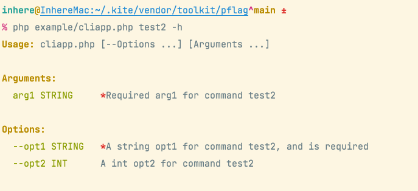
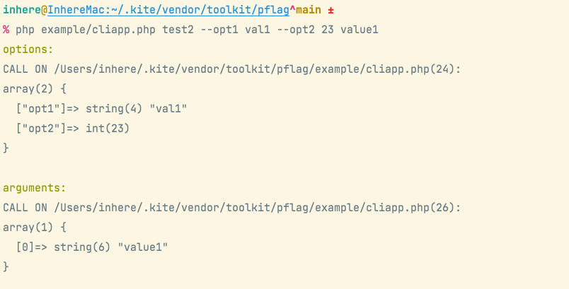

# PHP Flag

[](LICENSE)
[](https://github.com/php-toolkit/pflag)
[](https://github.com/php-toolkit/pflag/actions)
[](https://packagist.org/packages/toolkit/pflag)
[](https://packagist.org/packages/toolkit/pflag)
[](https://coveralls.io/github/php-toolkit/pflag?branch=main)
[](README.zh-CN.md)

Generic PHP command line flags parse library

> Github: [php-toolkit/pflag](https://github.com/php-toolkit/pflag)

## Features

- Generic command line options and arguments parser.
- Support set value data type(`int,string,bool,array`), will auto format input value.
- Support set multi alias names for an option.
- Support set multi short names for an option.
- Support set default value for option/argument.
- Support read flag value from ENV var.
- Support set option/argument is required.
- Support set validator for check input value.
- Support auto render beautiful help message.

**Flag Options**:

- Options start with `-` or `--`, and the first character must be a letter
- Support long option. eg: `--long` `--long value`
- Support short option. eg: `-s -a value`
- Support define array option
  - eg: `--tag php --tag go` will get `tag: [php, go]`

**Flag Arguments**:

- Support binding named arguemnt
- Support define array argument

### Quick build command

- Use `Toolkit\PFlag\CliCmd` to quickly build a simple command application
- Use `Toolkit\PFlag\CliApp` to quickly build a command application that supports subcommands

## Install

- Require PHP 8.0+

**composer**

```bash
composer require toolkit/pflag
```

-----------

## Flags Usage

Flags - is an cli flags(options&argument) parser and manager.

> example codes please see [example/flags-demo.php](example/flags-demo.php)

### Create Flags

```php
use Toolkit\PFlag\Flags;

require dirname(__DIR__) . '/test/bootstrap.php';

$flags = $_SERVER['argv'];
// NOTICE: must shift first element.
$scriptFile = array_shift($flags);

$fs = Flags::new();
// can with some config
$fs->setScriptFile($scriptFile);
/** @see Flags::$settings */
$fs->setSettings([
    'descNlOnOptLen' => 26
]);

// ...
```

### Define options

Examples for add flag option define:

```php
use Toolkit\PFlag\Flag\Option;
use Toolkit\PFlag\FlagType;
use Toolkit\PFlag\Validator\EnumValidator;

// add options
// - quick add
$fs->addOpt('age', 'a', 'this is a int option', FlagType::INT);

// - use string rule
$fs->addOptByRule('name,n', 'string;this is a string option;true');

// - use array rule
/** @see Flags::DEFINE_ITEM for array rule */
$fs->addOptByRule('name-is-very-lang', [
    'type'   => FlagType::STRING,
    'desc'   => 'option name is to lang, desc will print on newline',
    'shorts' => ['d','e','f'],
    // TIP: add validator limit input value.
    'validator' => EnumValidator::new(['one', 'two', 'three']),
]);

// -- add multi option at once.
$fs->addOptsByRules([
    'tag,t' => 'strings;array option, allow set multi times',
    'f'     => 'bool;this is an bool option',
]);

// - use Option
$opt = Option::new('str1', "this is  string option, \ndesc has multi line, \nhaha...");
$opt->setDefault('defVal');
$fs->addOption($opt);
```

### Define Arguments

Examples for add flag argument define:

```php
use Toolkit\PFlag\Flag\Argument;
use Toolkit\PFlag\FlagType;

// add arguments
// - quick add
$fs->addArg('strArg1', 'the is string arg and is required', 'string', true);

// - use string rule
$fs->addArgByRule('intArg2', 'int;this is a int arg and with default value;no;89');

// - use Argument object
$arg = Argument::new('arrArg');
// OR $arg->setType(FlagType::ARRAY);
$arg->setType(FlagType::STRINGS);
$arg->setDesc("this is an array arg,\n allow multi value,\n must define at last");

$fs->addArgument($arg);
```

### Parse Input

```php
use Toolkit\PFlag\Flags;
use Toolkit\PFlag\FlagType;

// ...

if (!$fs->parse($flags)) {
    // on render help
    return;
}

vdump($fs->getOpts(), $fs->getArgs());
```

**Show help**

```bash
$ php example/flags-demo.php --help
```

Output:


**Run demo:**

```bash
$ php example/flags-demo.php --name inhere --age 99 --tag go -t php -t java -d one -f arg0 80 arr0 arr1
```

Output:

```text
# options
array(6) {
  ["str1"]=> string(6) "defVal"
  ["name"]=> string(6) "inhere"
  ["age"]=> int(99)
  ["tag"]=> array(3) {
    [0]=> string(2) "go"
    [1]=> string(3) "php"
    [2]=> string(4) "java"
  }
  ["name-is-very-lang"]=> string(3) "one"
  ["f"]=> bool(true)
}

# arguments
array(3) {
  [0]=> string(4) "arg0"
  [1]=> int(80)
  [2]=> array(2) {
    [0]=> string(4) "arr0"
    [1]=> string(4) "arr1"
  }
}
```

-----------

## Get Value

Get flag value is very simple, use method `getOpt(string $name)` `getArg($nameOrIndex)`.

> TIP: Will auto format input value by define type.

**Options**

```php
$force = $fs->getOpt('f'); // bool(true)
$age  = $fs->getOpt('age'); // int(99)
$name = $fs->getOpt('name'); // string(inhere)
$tags = $fs->getOpt('tags'); // array{"php", "go", "java"}
```

**Arguments**

```php
$arg0 = $fs->getArg(0); // string(arg0)
// get an array arg
$arrArg = $fs->getArg(1); // array{"arr0", "arr1"}
// get value by name
$arrArg = $fs->getArg('arrArg'); // array{"arr0", "arr1"}
```

-----------

## Build simple cli app

In the pflag, built in `CliApp` and `CliCmd` for quick create and run an simple console application.

### Create simple alone command

Build and run a simple command handler. see example file [example/clicmd.php](example/clicmd.php)

```php
use Toolkit\Cli\Cli;
use Toolkit\PFlag\CliCmd;
use Toolkit\PFlag\FlagsParser;

CliCmd::new()
    ->config(function (CliCmd $cmd) {
        $cmd->name = 'demo';
        $cmd->desc = 'description for demo command';

        // config flags
        $cmd->options = [
            'age, a'  => 'int;the option age, is int',
            'name, n' => 'the option name, is string and required;true',
            'tags, t' => 'array;the option tags, is array',
        ];
        // or use property
        // $cmd->arguments = [...];
    })
    ->withArguments([
        'arg1' => 'this is arg1, is string'
    ])
    ->setHandler(function (FlagsParser $fs) {
        Cli::info('options:');
        vdump($fs->getOpts());
        Cli::info('arguments:');
        vdump($fs->getArgs());
    })
    ->run();
```

**Usage:**

```php
# show help
php example/clicmd.php -h
# run command
php example/clicmd.php --age 23 --name inhere value1
```

- Display help:


- Run command:


### Create an multi commands app

Create an multi commands application, run subcommand. see example file [example/cliapp.php](example/cliapp.php)

```php
use Toolkit\Cli\Cli;
use Toolkit\PFlag\CliApp;
use Toolkit\PFlag\FlagsParser;
use Toolkit\PFlagTest\Cases\DemoCmdHandler;

$app = new CliApp();

$app->add('test1', fn(FlagsParser $fs) => vdump($fs->getOpts()), [
    'desc'    => 'the test 1 command',
    'options' => [
        'opt1' => 'opt1 for command test1',
        'opt2' => 'int;opt2 for command test1',
    ],
]);

$app->add('test2', function (FlagsParser $fs) {
    Cli::info('options:');
    vdump($fs->getOpts());
    Cli::info('arguments:');
    vdump($fs->getArgs());
}, [
    // 'desc'    => 'the test2 command',
    'options' => [
        'opt1' => 'a string opt1 for command test2',
        'opt2' => 'int;a int opt2 for command test2',
    ],
    'arguments' => [
        'arg1' => 'required arg1 for command test2;true',
    ]
]);

// fn - required php 7.4+
$app->add('show-err', fn() => throw new RuntimeException('test show exception'));

$app->addHandler(DemoCmdHandler::class);

$app->run();
```

**Usage:**

```php
# show help
php example/cliapp.php -h
# run command
php example/cliapp.php test2 --opt1 val1 --opt2 23 value1
```

- Display commands:


- Command help:



- Run command:



-----------

## Flag rule

The options/arguments rules. Use rule can quick define an option or argument.

- string value is rule(`type;desc;required;default;shorts`).
- array is define item `SFlags::DEFINE_ITEM`
- supported type see `FlagType::*`

```php
use Toolkit\PFlag\FlagType;

$rules = [
     // v: only value, as name and use default type FlagType::STRING
     // k-v: key is name, value can be string|array
     'long,s',
     // name => rule
     'long,a,b' => 'int', // long is option name, a and b is shorts.
     'f'      => FlagType::BOOL,
     'str1'   => ['type' => 'int', 'desc' => 'an string option'],
     'tags'   => 'array', // can also: ints, strings
     'name'   => 'type;the description message;required;default', // with desc, default, required
]
```

**For options**

- option allow set shorts

> TIP: name `long,a,b` - `long` is the option name. remaining `a,b` is short names.

**For arguments**

- argument no alias/shorts
- array value only allow defined at last

**Definition item**

The const `Flags::DEFINE_ITEM`:

```php
public const DEFINE_ITEM = [
    'name'      => '',
    'desc'      => '',
    'type'      => FlagType::STRING,
    'helpType'  => '', // use for render help
    // 'index'    => 0, // only for argument
    'required'  => false,
    'default'   => null,
    'shorts'    => [], // only for option
    // value validator
    'validator' => null,
    // 'category' => null
];
```

-----------

## Custom settings

### Settings for parse

```php
    // -------------------- settings for parse option --------------------

    /**
     * Stop parse option on found first argument.
     *
     * - Useful for support multi commands. eg: `top --opt ... sub --opt ...`
     *
     * @var bool
     */
    protected $stopOnFistArg = true;

    /**
     * Skip on found undefined option.
     *
     * - FALSE will throw FlagException error.
     * - TRUE  will skip it and collect as raw arg, then continue parse next.
     *
     * @var bool
     */
    protected $skipOnUndefined = false;

    // -------------------- settings for parse argument --------------------

    /**
     * Whether auto bind remaining args after option parsed
     *
     * @var bool
     */
    protected $autoBindArgs = true;

    /**
     * Strict match args number.
     * if exist unbind args, will throw FlagException
     *
     * @var bool
     */
    protected $strictMatchArgs = false;

```

### Setting for render help

support some settings for render help

```php

    // -------------------- settings for built-in render help --------------------

    /**
     * Auto render help on provide '-h', '--help'
     *
     * @var bool
     */
    protected $autoRenderHelp = true;

    /**
     * Show flag data type on render help.
     *
     * if False:
     *
     * -o, --opt    Option desc
     *
     * if True:
     *
     * -o, --opt STRING   Option desc
     *
     * @var bool
     */
    protected $showTypeOnHelp = true;

    /**
     * Will call it on before print help message
     *
     * @var callable
     */
    private $beforePrintHelp;

```

- custom help message renderer

```php
$fs->setHelpRenderer(function (\Toolkit\PFlag\FlagsParser $fs) {
    // render help messages
});
```

-----------

## Unit tests

```bash
phpunit --debug
```

test with coverage:

```bash
phpdbg -dauto_globals_jit=Off -qrr $(which phpunit) --coverage-text
phpdbg -dauto_globals_jit=Off -qrr $(which phpunit) --coverage-clover ./test/clover.info
# use xdebug
phpunit --coverage-clover ./test/clover.info
```

## Project use

Check out these projects, which use https://github.com/php-toolkit/pflag :

- [inhere/console](https://github.com/inhere/console) Full-featured php command line application library.
- [kite](https://github.com/inhere/kite) Kite is a tool for help development.
- More, please see [Packagist](https://packagist.org/packages/toolkit/pflag)

## License

[MIT](LICENSE)
