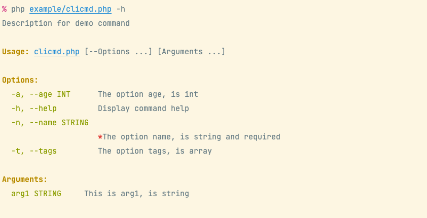

# PHP Flag

[](LICENSE)
[](https://github.com/php-toolkit/pflag)
[](https://github.com/php-toolkit/pflag/actions)
[](https://packagist.org/packages/toolkit/pflag)
[](https://packagist.org/packages/toolkit/pflag)
[](https://coveralls.io/github/php-toolkit/pflag?branch=main)
[](README.md)

`pflag` - PHP编写的，通用的命令行标志(选项和参数)解析库

> Github: [php-toolkit/pflag](https://github.com/php-toolkit/pflag)

## 功能说明

- 通用的命令行选项和参数解析器
- 支持设置值数据类型(`int,string,bool,array`)，将自动格式化输入值
- 支持为选项/参数设置默认值
- 支持为一个选项设置多个别名
- 支持为一个选项设置多个短名称
- 支持从环境变量读取标志值
- 支持设置选项/参数为必须的(`required`)
- 支持设置验证器以检查输入值
- 支持自动渲染漂亮的帮助信息。

**命令行选项**:

- 选项以 `-` 或者 `--` 开头的，且首字符必须是字母
- 以 `--` 开头的为长选项. eg: `--long` `--long value`
- 以 `-` 开头的为短选项 `-s -a value`
- 支持定义数组选项
    - eg: `--tag php --tag go` 将会得到 `$tag = [php, go]`

**命令行参数**:

- 不能满足选项的都认作参数
- 支持绑定命名参数
- 支持定义数组参数

### 快速构建命令

- 使用 `Toolkit\PFlag\CliCmd` 可以快速的构建一个简单的命令应用
- 使用 `Toolkit\PFlag\CliApp` 可以快速的构建一个支持子命令的命令应用

## 安装

- Require PHP 8.0+

**composer 安装**

```bash
composer require toolkit/pflag
```

-----------

## Flags 使用

Flags - 是一个命令行标志（选项和参数）解析器和管理器。

> 示例代码请参见 [example/flags-demo.php](example/flags-demo.php)

### 创建解析器

创建和初始化解析器

```php
use Toolkit\PFlag\Flags;

require dirname(__DIR__) . '/test/bootstrap.php';

$flags = $_SERVER['argv'];
// NOTICE: must shift first element.
$scriptFile = array_shift($flags);

$fs = Flags::new();

// （可选的）可以添加一些自定义设置
$fs->setScriptFile($scriptFile);
/** @see Flags::$settings */
$fs->setSettings([
    'descNlOnOptLen' => 26
]);

// ...
```

### 定义选项

定义选项 - 定义好支持的选项设置，解析时将会根据定义来解析输入

添加选项定义的示例:

```php
use Toolkit\PFlag\Flag\Option;
use Toolkit\PFlag\FlagType;
use Toolkit\PFlag\Validator\EnumValidator;

// add options
// - quick add
$fs->addOpt('age', 'a', 'this is a int option', FlagType::INT);

// - 使用字符串规则快速添加选项定义
$fs->addOptByRule('name,n', 'string;this is a string option;true');

// -- 一次添加多个选项
$fs->addOptsByRules([
    'tag,t' => 'strings;array option, allow set multi times',
    'f'     => 'bool;this is an bool option',
]);

// - 使用数组定义
/** @see Flags::DEFINE_ITEM for array rule */
$fs->addOptByRule('name-is-very-lang', [
    'type'   => FlagType::STRING,
    'desc'   => 'option name is to lang, desc will print on newline',
    'shorts' => ['d','e','f'],
    // TIP: add validator limit input value.
    'validator' => EnumValidator::new(['one', 'two', 'three']),
]);

// - 使用 Option 对象
$opt = Option::new('str1', "this is  string option, \ndesc has multi line, \nhaha...");
$opt->setDefault('defVal');
$fs->addOption($opt);
```

### 定义参数

定义参数 - 定义好支持的选项设置，解析时将会根据定义来解析输入

添加参数定义的示例:

```php
use Toolkit\PFlag\Flag\Argument;
use Toolkit\PFlag\FlagType;

// add arguments
// - quick add
$fs->addArg('strArg1', 'the is string arg and is required', 'string', true);

// - 使用字符串规则快速添加定义
$fs->addArgByRule('intArg2', 'int;this is a int arg and with default value;no;89');

// - 使用 Argument 对象
$arg = Argument::new('arrArg');
// OR $arg->setType(FlagType::ARRAY);
$arg->setType(FlagType::STRINGS);
$arg->setDesc("this is an array arg,\n allow multi value,\n must define at last");

$fs->addArgument($arg);
```

### 解析命令行输入

最后调用 `parse()` 解析命令行输入数据

```php
// ...

if (!$fs->parse($flags)) {
    // on render help
    return;
}

vdump($fs->getOpts(), $fs->getArgs());
```

**显示帮助**

当输入 `-h` 或 `--help` 会自动渲染帮助信息。

```bash
$ php example/flags-demo.php --help
```

Output:


**运行示例:**

```bash
$ php example/flags-demo.php --name inhere --age 99 --tag go -t php -t java -d one -f arg0 80 arr0 arr1
```

输出结果:

```text
# 选项数据
array(6) {
  ["str1"]=> string(6) "defVal"
  ["name"]=> string(6) "inhere"
  ["age"]=> int(99)
  ["tag"]=> array(3) {
    [0]=> string(2) "go"
    [1]=> string(3) "php"
    [2]=> string(4) "java"
  }
  ["name-is-very-lang"]=> string(3) "one"
  ["f"]=> bool(true)
}

# 参数数据 
array(3) {
  [0]=> string(4) "arg0"
  [1]=> int(80)
  [2]=> array(2) {
    [0]=> string(4) "arr0"
    [1]=> string(4) "arr1"
  }
}
```

-----------

## SFlags 使用

SFlags - 是一个简洁版本的标志（选项、参数）解析器和管理器

### 使用示例

```php
use Toolkit\PFlag\SFlags;

$fs = SFlags::new();

// 模拟输入参数
$flags = ['--name', 'inhere', '--age', '99', '--tag', 'php', '-t', 'go', '--tag', 'java', '-f', 'arg0'];

$optRules = [
    'name', // string
    'age'   => 'int;an int option;required', // set required
    'tag,t' => FlagType::ARRAY,
    'f'     => FlagType::BOOL,
];
$argRules = [
    // some argument rules
];

$fs->setOptRules($optRules);
$fs->setArgRules($argRules);
$fs->parse($rawFlags);
// or use
// $fs->parseDefined($flags, $optRules, $argRules);

vdump($fs->getOpts(), $fs->getRawArgs());
```

Output:

```text
array(3) {
  ["name"]=> string(6) "inhere"
  ["tag"]=> array(3) {
    [0]=> string(3) "php"
    [1]=> string(2) "go"
    [2]=> string(4) "java"
  }
  ["f"]=> bool(true)
}
array(1) {
  [0]=> string(4) "arg0"
}
```

### 解析命令行输入

将代码写入 php 文件(示例请看 [example/sflags-demo.php](example/sflags-demo.php))

```php
use Toolkit\PFlag\SFlags;

$rawFlags = $_SERVER['argv'];
// NOTICE: must shift first element.
$scriptFile = array_shift($rawFlags);

$optRules = [
    // some option rules
    'name', // string
    'age'   => 'int;an int option;required', // set required
    'tag,t' => FlagType::ARRAY,
    'f'     => FlagType::BOOL,
];
$argRules = [
    // some argument rules
    'string',
    // set name
    'arrArg' => 'array',
];

$fs->setOptRules($optRules);
$fs->setArgRules($argRules);
$fs->parse($rawFlags);
```

**运行示例:**

```bash
php example/sflags-demo.php --name inhere --age 99 --tag go -t php -t java -f arg0 arr0 arr1
```

输出:

```text
# 选项数据
array(4) {
  ["name"]=> string(6) "inhere"
  ["age"]=> int(99)
  ["tag"]=> array(3) {
    [0]=> string(2) "go"
    [1]=> string(3) "php"
    [2]=> string(4) "java"
  }
  ["f"]=> bool(true)
}

# 参数数据
array(2) {
  [0]=> string(4) "arg0"
  [1]=> array(2) {
    [0]=> string(4) "arr0"
    [1]=> string(4) "arr1"
  }
}
```

**显示帮助**

```bash
$ php example/sflags-demo.php --help
```

-----------

## 获取输入值

获取flag值很简单，使用方法 `getOpt(string $name)` `getArg($nameOrIndex)` 即可.

> TIP: 将通过定义的数据类型自动格式化输入值

**选项数据**

```php
$force = $fs->getOpt('f'); // bool(true)
$age  = $fs->getOpt('age'); // int(99)
$name = $fs->getOpt('name'); // string(inhere)
$tags = $fs->getOpt('tags'); // array{"php", "go", "java"}
```

**参数数据**

```php
$arg0 = $fs->getArg(0); // string(arg0)
// get an array arg
$arrArg = $fs->getArg(1); // array{"arr0", "arr1"}
// get value by name
$arrArg = $fs->getArg('arrArg'); // array{"arr0", "arr1"}
```
-----------

## 创建简单的独立命令或应用程序

在 pflag 中，内置了 `CliApp` 和 `CliCmd` 两个独立类，用于快速创建和运行一个简单的控制台应用程序。

### 创建简单的单独命令

使用 `CliCmd` 可以方便的构建并运行一个简单的命令处理程序。查看示例文件 [example/clicmd.php](example/clicmd.php)

```php
use Toolkit\Cli\Cli;
use Toolkit\PFlag\CliCmd;
use Toolkit\PFlag\FlagsParser;

CliCmd::new()
    ->config(function (CliCmd $cmd) {
        $cmd->name = 'demo';
        $cmd->desc = 'description for demo command';

        // config flags
        $cmd->options = [
            'age, a'  => 'int;the option age, is int',
            'name, n' => 'the option name, is string and required;true',
            'tags, t' => 'array;the option tags, is array',
        ];
        // or use property
        // $cmd->arguments = [...];
    })
    ->withArguments([
        'arg1' => 'this is arg1, is string'
    ])
    ->setHandler(function (FlagsParser $fs) {
        Cli::info('options:');
        vdump($fs->getOpts());
        Cli::info('arguments:');
        vdump($fs->getArgs());
    })
    ->run();
```

**使用:**

```php
# show help
php example/clicmd.php -h
# run command
php example/clicmd.php --age 23 --name inhere value1
```

- 显示帮助:



- 运行命令:


### Create an multi commands app

Create an multi commands application, run subcommand. see example file [example/cliapp.php](example/cliapp.php)

```php
use Toolkit\Cli\Cli;
use Toolkit\PFlag\CliApp;
use Toolkit\PFlag\FlagsParser;

$app = new CliApp();

$app->add('test1', fn(FlagsParser $fs) => vdump($fs->getOpts()), [
    'desc'    => 'the test 1 command',
    'options' => [
        'opt1' => 'opt1 for command test1',
        'opt2' => 'int;opt2 for command test1',
    ],
]);

$app->add('test2', function (FlagsParser $fs) {
    Cli::info('options:');
    vdump($fs->getOpts());
    Cli::info('arguments:');
    vdump($fs->getArgs());
}, [
    // 'desc'    => 'the test2 command',
    'options' => [
        'opt1' => 'a string opt1 for command test2',
        'opt2' => 'int;a int opt2 for command test2',
    ],
    'arguments' => [
        'arg1' => 'required arg1 for command test2;true',
    ]
]);

// fn - required php 7.4+
$app->add('show-err', fn() => throw new RuntimeException('test show exception'));

$app->run();
```

**使用:**

```php
# show help
php example/cliapp.php -h
# run command
php example/cliapp.php test2 --opt1 val1 --opt2 23 value1
```

- 显示帮助，命令列表:


- 显示子命令帮助:


- 运行一个命令:


-----------

## 扩展：规则定义 

选项参数规则。使用规则可以快速定义一个选项或参数。

- string 字符串规则以分号 `;` 分割每个部分 (完整规则：`type;desc;required;default;shorts`).
- array 规则按 `SFlags::DEFINE_ITEM` 设置定义
- 支持的类型常量请看 `FlagType::*`

```php
use Toolkit\PFlag\FlagType;

$rules = [
     // v: 只有值，作为名称并使用默认类型 FlagType::STRING
     // k-v: 键是名称，值可以是字符串|数组
     'long,s',
     // name => rule
     'long,a,b' => 'int;an int option', // long is option name, a and b is shorts.
     'f'      => FlagType::BOOL,
     'str1'   => ['type' => 'int', 'desc' => 'an string option'],
     'tags'   => 'array; an array option', // can also: ints, strings
     'name'   => 'type;the description message;required;default', // with desc, default, required
]
```

**对于选项**

- 选项允许设置短名称 `shorts`

> TIP: 例如 `long,a,b` - `long` 是选项名称. 剩余的 `a,b` 都是它的短选项名.

**对于参数**

- 参数没有别名或者短名称
- 数组参数只允许定义在最后

**数组定义项**

常量 `Flags::DEFINE_ITEM`:

```php
public const DEFINE_ITEM = [
    'name'      => '',
    'desc'      => '',
    'type'      => FlagType::STRING,
    'helpType'  => '', // use for render help
    // 'index'    => 0, // only for argument
    'required'  => false,
    'default'   => null,
    'shorts'    => [], // only for option
    // value validator
    'validator' => null,
    // 'category' => null
];
```

-----------

## 自定义设置

### 解析设置

```php
    // -------------------- 选项解析设置 --------------------

    /**
     * Stop parse option on found first argument.
     *
     * - Useful for support multi commands. eg: `top --opt ... sub --opt ...`
     *
     * @var bool
     */
    protected $stopOnFistArg = true;

    /**
     * Skip on found undefined option.
     *
     * - FALSE will throw FlagException error.
     * - TRUE  will skip it and collect as raw arg, then continue parse next.
     *
     * @var bool
     */
    protected $skipOnUndefined = false;

    // -------------------- 参数解析设置 --------------------

    /**
     * Whether auto bind remaining args after option parsed
     *
     * @var bool
     */
    protected $autoBindArgs = true;

    /**
     * Strict match args number.
     * if exist unbind args, will throw FlagException
     *
     * @var bool
     */
    protected $strictMatchArgs = false;

```

### 渲染帮助设置

support some settings for render help

```php

    // -------------------- settings for built-in render help --------------------

    /**
     * 自动渲染帮助信息当输入 '-h', '--help' 选项时
     *
     * @var bool
     */
    protected $autoRenderHelp = true;

    /**
     * 在渲染的帮助信息上显示数据类型
     *
     * if False:
     *
     * -o, --opt    Option desc
     *
     * if True:
     *
     * -o, --opt STRING   Option desc
     *
     * @var bool
     */
    protected $showTypeOnHelp = true;

    /**
     * 将在打印帮助消息之前调用它
     *
     * @var callable
     */
    private $beforePrintHelp;

```

自定义帮助消息渲染:

```php
$fs->setHelpRenderer(function (\Toolkit\PFlag\FlagsParser $fs) {
    // render help messages
});
```

-----------

## 单元测试

```bash
phpunit --debug
```

test with coverage:

```bash
phpdbg -qrr $(which phpunit) --coverage-text
```

## 使用pflag的项目

Check out these projects, which use https://github.com/php-toolkit/pflag :

- [inhere/console](https://github.com/inhere/console) Full-featured php command line application library.
- [kite](https://github.com/inhere/kite) Kite is a tool for help development.
- More, please see [Packagist](https://packagist.org/packages/toolkit/pflag)

## License

[MIT](LICENSE)
